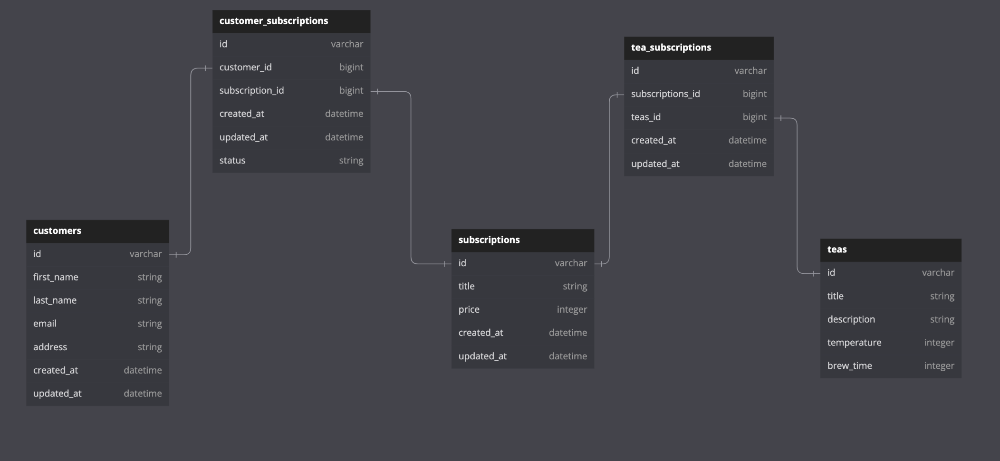

 This project is a Rails API for a Tea Subscription Service.

## About the Project
  This project demonstrates a strong understanding of Rails, ability to create restful routes, demonstration of well-organized code, following OOP, TDD and clear documentation.

## Built With


## Gems


## Set Up
- Clone this repo
- `bundle install`
- `rails db:{create,migrate,seed}`

## Database Structure



## Deployment
- `rails s`

## Testing Instructions

- After Setup:
    * `bundle exec rspec`

## End Points

#### CustomerSubscriptions

```
post http://localhost:3000/api/v1/customer_subscriptions
```
##### parameters(raw json):
```
{
 "customer_id": 3,
 "subscription_id": "3"
}


```
##### response:
```
{
    "data": {
        "id": "4",
        "type": "customer_subscription",
        "attributes": {
            "customer_id": 3,
            "subscription_id": 3,
            "status": "active"
        }
    }
}
```


```
patch http://localhost:3000/api/v1/customer_subscriptions/3
```
##### parameters(raw json):
```
{
 "status": "active"
}
```
##### OR
```
{
 "status": "cancelled"
}
```

##### response:
```
{
    "data": {
        "id": "3",
        "type": "customer_subscription",
        "attributes": {
            "customer_id": 2,
            "subscription_id": 3,
            "status": "active"
        }
    }
}
```

##### or
```
{
    "data": {
        "id": "3",
        "type": "customer_subscription",
        "attributes": {
            "customer_id": 2,
            "subscription_id": 3,
            "status": "cancelled"
        }
    }
}
```
#### Customer's Subscriptions

```
get http://localhost:3000/api/v1/customers/2/subscriptions
```

##### response:
```
{
    "data": [
        {
            "id": "2",
            "type": "subscriptions",
            "attributes": {
                "title": "Medium Subscription",
                "price": 20
            }
        },
        {
            "id": "3",
            "type": "subscriptions",
            "attributes": {
                "title": "Basic Subscription",
                "price": 10
            }
        }
    ]
}
```

takeaways, lessons learned, challenges 